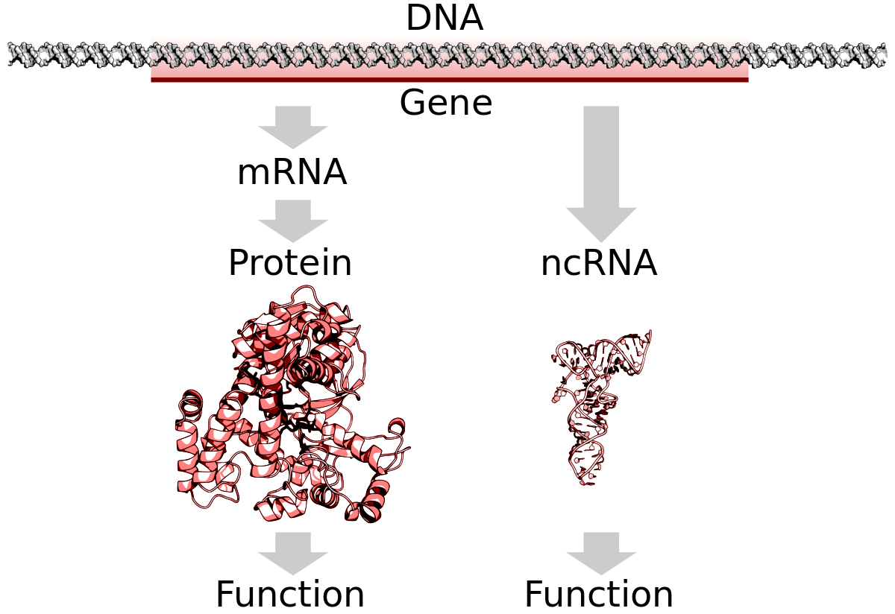

# chapter_paradata

## Abstract

Here we define paradata as the data that describes the generation of data.
In genetic epidemiology, the data generated is mostly the results 
of an analysis (e.g. predicting a person having a disease),
as done by computer code.
In such context, paradata is usually the scientific paper that
describes what the computer code does.
However, this has the unrealtistic 
assumption that there is a perfect match between the paper and the code.
In this chapter it is argued that the source code should should be supplied,
as this is the true paradata: if the paper and code disagree, it is the
code that has generated the results.
The chapter concludes by some rules how to allow code to serve as paradata,
and hence allowing theoretical biology research to be truly reproducible.

## Definitions

Term     | Definition                                            | Example
---------|-------------------------------------------------------|--------------------------------------------------------------
Data     | Individual facts, statistics, or items of information | A SNP that has a significant association
Paradata | Data that describes the generation of data            | The code to conclude that a SNP has a significant association
Metadata | Data that provides information about other data       | The article that describes an experiment

## Introduction

```
This section has paragraph headers. This helps me, the author,
to focus the contents of my paragraphs.
In the final version of this manuscript, these will be removed.
```

### Universities produce knowledge

The currency that universities generate is knowledge, which in turn is distributed
in mostly lectures and academic papers.
Academic papers contain knowledge, either as the
report of measurements or the outcome of an experiment.
These reports are described in English, the current lingua franca of science.

### A paper contains data and should be FAIR data

A paper contains and/or describes data, where we define
data as 'individual facts, statistics, or items of information, often 
numeric' [OECD 2008].
To ensure unhampered knowledge growth, this data should [TODO: Why? Reference!] 
follow the FAIR 
principles.
The FAIR principles [Wilkinson et al., 2016] are that data should be 
[TODO: there are probably better examples]
Findable (e.g. found by web),
Accessible (e.g. DataDryad and or Zenoda), 
Interoperable (e.g. comma-separated files) 
and Reusable (e.g. work on all operating systems)

### A paper is data and should be FAIR data

A paper in itself is data, as it is a collection of text and
figures that we itself can do measurements upon.
Also here, a paper should be FAIR, 
[TODO: there are probably better examples]
i.e.
Findable (e.g. Google Scholar)
Accessible (e.g. view it online), 
Interoperable (e.g. written in English)
and Reusable (e.g. it is valid to cite and build upon earlier academic papers).
This paper itself will later specify the standpoint that a paper
is metadata (i.e. data about data), instead of paradata (i.e.
data that describes the collection of data)

### For some fields, the experiment is actually run by code

This paper focusses on research fields that uses computation
to do experiments and uses genetic epidemiology as an example.
Genetic epidemiology is a field within biology that, among 
others, measures the spread (hence 'epidemiology') 
of heritable (i.e. genetic) traits, as well as the relation
between having a certain genetic makeup and a certain trait,
where the trait can be any human property, such as weight, height,
the amount of metabolites and having a disease yes/no.


> Figure F2: Picture of Karesuando's church,
> the village where the Northern Swedish Population
> Health Study started.
> From [Höpfner, 2005]

As an example, we'll use a pseudorandomly selected paper
from [Ahsan et al., 2017]. The data used by that paper is
from a population study called the Northern Swedish Population
Health Study (NSPHS) that started in 2010 [Igl et al., 2010]. 
The approximately 1000 participants were initially mostly surveyed
about lifestyle [Igl et al., 2010] and follow-up studies
provided the type of data relevant for this paper, 
which are (1) the genetic data [Johansson et al., 2013],
(2) the concentration of certain proteins in the 
blood [Enroth et al., 2014][Enroth et al., 2015].


> Fig F3: A cell has a nucleus that contains chromosomes. 
> Each of these chromosomes (46 in humans) consist out of DNA. 
> DNA itself conists out of 4 nucleotides, 
> as depicted by the horizontal sticks 
> with the colors red, yellow, green and blue.
> From [Sponk et al., 2012]

The first type of data, the (final form of the) genetic data,
consists out of single nucleotide polymorphisms (SNPs).
SNPs consist out of a name, a position and a nucleotide. 
DNA (organized into chromosomes and present in every (nucleated) cell, 
see figure F3) consists out of many nucleotides, of which there are four types,
called adenosine, cytosine, guanine and thyrosine, all commonly abreviated
as A, C, G and T respectively.
One SNP example is, that 'rs12133641' is a SNP located at position 154,428,283,
where some people have a certain nucleotide. In this case, 
67 percent of the people within this study have an A,
and 33 percent have a G (also from [Ahsan et al., 2017], Table S3).



> Fig F5: Parts of DNA (so-called 'genes') code for proteins. 
> The DNA, that always stays put in the cell's nucleus, 
> is transcripted to messenger RNA (mRNA).
> mRNA leaves the nucleus and its code gets translated to 
> a protein sequence.
> Near the start of a gene are regions that determine the amount
> of proteins produced (not shown in figure).
> Adapted from [Shafee, 2015]

The second type of data are concentrations of certain proteins in the 
blood. DNA contains the code for building proteins (see Figure F5), 
as well as the rate
at which a protein is created. Some proteins end up in the blood and
their presence can be used to assess the health of an individual.
IL6RA is a protein [TODO: more info]

The field of genetic epidemiology looks -among others- for
correlations between genetic data and biological traits.
For example, figure F10 (from [Ahsan et al., 2017]) shows that
SNP rs12133641 is highly correlated (p value is 3.0 * 10e-73, 
961 individuals) with protein IL6RA. What this results does
not yet teach us, is how this correlation works, yet
figure F20 shows us the direction of the association:
the X axis shows the possible genetic make-ups (aka the genotype) of the individuals,
where 0 denotes the individuals with genotype
AA (the individual inherited one adenosine 
from his/here mother and one adenosine from his/her father), 
1.0 denotes AG (one A is inherited from one parent, 
where the G is inherited from the other parent) and 2.0 denotes GG.
From Figure F20 we can conclude that, on average,
the more guanines are inherited at that SNPs location,
the higher concentration of IL6RA can be found in a human's blood.
There is, however, a certain amount variance per genotype
and 'only' 43 percent of the variance can be attributed to an individuals'
genotype. There are multiple reasons why a genotype 
does not completely determine a phenotype, such as the effect
of the environment (e.g. geographic location), lifestyle (e.g. smoking yes/no)
or having a disease.


> Figure F10 shows an example result of a genetic epideological research.
> It shows that the SNP named rs12133641 (located at position 154,428,283
> of chromosome 1) is highly correlated (p value is 3.0 * 10e-73, 
> 961 individuals) to the concentration of the protein IL6RA, as measured
> in blood. The table is a simplified result from [Ahsan et al., 2017].


> Figure F20: the relation between the genotype for SNP rs12133641 
> and the protein concentration of IL6RA is relatively strong.
> The X axis shows the the genotype of the individuals,
> where 0 denotes AA, 1.0 denotes AG and 2.0 denotes GG.
> The Y axis shows the concentration of the protein IL6RA 
> as found in the participants' blood.

### The experiments within genetic epidemology works are done by code

The experiment described above is run by code. There is no fieldwork,
nor lab-work involved. It is the researcher that writes the code,
after which the code does the work. A genetic epidemiologist that
looks for associations between genotype and phenotype,
one does not need a lab.

To **obtain** the genetic data, yes, there may be fieldwork and/or lab-work
involved. For example, a researcher needs to go into the field to take
samples (e.g. blood) of humans or other species. To analyse these samples,
a researcher needs a lab. Depending on the technique being used on
how to analyse the samples, there may be a big bioinformatics step
to aggregate the measurements into useful genetic data. 
Although this paper does not focus on the code run to 
aggragate the raw data into useful genetic data, the same arguments
can be made for that code as in the example: that code is 
the ground truth of how the raw data is collected into useful genetic data.

### The code is the paradata for the results of an experiment

Programming code is paradata, as it is data that describes how data is collected,
which is the definition of paradata [TODO: REF].
Programming code is data that is usually in the form of text, 
spread over one or more files, that describes the experiment.
The experiment collects the data.
The data collected is the data we call the results of an experiment.

The article is metadata, as it is data that describes other
data, which is the definition of metadata [TODO: REF]:
an article describes the
experiment and hence the programming
code in English. However, it is not the best
candidate to describe how the data is collected,
as it has a loose connection with collecting the data.
Again, if the code and article of an experiment disagree,
it is the code that actually let the data be collected.  
Instead, an article is metadata about a research.

### Code should be published

For science to be reproducible (a fundamental property of the scientific 
method), it is the code that should be published, instead of the
English description of what the code does (i.e. the article), if one
would have to pick one, as it is the code does the actual work.
Hence, from a knowledge management perspective, emphasis should be
put more on the preservation of code, as it is the most important actor
in an experiment.

### Code has important properties

Code has three important properties, which -if a choice needed to be made-
make it the superior choice from a knowledge preservation point of view:
code contains the ground truth of an experiment,
it's text is more concise than English,
and it gives an honest indication of the quality of the experiment.
Optionally, code can actively teach what it does.
Here, I will go into more detail of each point.

#### Example of code being the ground truth

The first important property of code is that code holds the
ground truth of an experiment.
To illustrate this, consider this fictional example
of a text in a paper:

> We compared the values of `x` and `y` using a one-tailed T-test,
> as we expect `x` to be smaller

Taking a look at the (in this case, the programming language R) code, 
we find the following line:

```r
t.test(x, y)
```

For those unfamiliar with R: `t.test` is the name of an R function to do a T-test.
By default, however, this function does a **two**-tailed T-test.
Of course, we can specify to do a one-sided T-test as well,
and the code below seems like a corrected version:

```r
t.test(x, y, "less")
```

Again, this code tests if the **alternative** (i.e. `y`) is less.
Also in this example, the code mismatches the English text.

It is the paper that accompanies the code,
as it is the code that generates the results.
When humans are fallible and code gets bigger, the likelihood of
a mismatch between the English paper and the code increases.
But regardless of the size of the code, 
it is the code that is the ground truth.

### Example of code being concise

[TODO: unconvinced myself]

The second important property of code is that it is concise,
as code directly describes what it does;
complex pipelines should/cannot not be described in English in full detail

#### Example of code being convincing

As code is paradata, as it describes how data is being collected,
it can convince (or not) that it does so correctly.
Similar to a cell biologist that can be working sterile to avoid contamination
by airborne bacteria, 
or sloppy and likelier to have contaminated samples,
code can be examplary or sloppy.


### Need for code being available

To quote a review on reproducibility [Peng and Hicks, 2021], 
'Reproducibility is typically thwarted by a 
lack of availability of the original data and computer code'.
In the case of genetic epidemiology, it is a given that the original
data cannot be published as this data is sensitive.


### Code is hard to manage

Unlike English, code is fragile in standing the test of time.
Containers can alleviate this.
Code has a limited lifetime.

### Code has important metadata

 * Number of commits
 * Commit history
 * Code coverage


Knowledge management efforts typically focus on organisational objectives 
such as improved performance, competitive advantage, innovation, 
the sharing of lessons learned, integration and continuous improvement of the organisation.

 * [ ] introduce the practical situation where paradata is relevant for the readership
   clearly enough that even readers outside your own discipline can follow the rationale
   of your writing. Remember to describe explicitly (but briefly) your disciplinary
   (scholarly and practical) and research context, research front and motivate the 
   focus of the discussion. Please also state explicitly the relevance/implications
   of the results from and for your practical case/perspective.


## M


In addition, we would like to direct your attention to a couple of general issues. Our volume will appear in a book series that relates to knowledge management. This means that we are going to discuss the chapters in the introduction and the epilogue/conclusions from a KM perspective and KM researchers and professionals are also, in a very broad sense,  one of the major target audiences of the volume as a whole. In a very broad sense, KM encompasses different aspects relevant to the management, governance, administration, curation and facilitation of information, knowledge, data, records etc. and related processes and practises. This does not mean that you need to assume a KM perspective in the chapter BUT if there are relevant management (or similar) aspects that stem from the discussion in the chapter, you are free to make a note of them.

As an additional remark, considering the interdisciplinarity of the volume we encourage you to illustrate the point you make in your chapter using a concrete problem that exists and provide enough information on the research (and practical) context you are writing about that a person outside of your own field can follow your argument. Moreover, remember to motivate the relevance of your findings and/or conclusions again considering the interdisciplinary audience.


 * [1] Cantor, Rita M., Kenneth Lange, and Janet S. Sinsheimer. "Prioritizing GWAS results: a review of statistical methods and recommendations for their application." The American Journal of Human Genetics 86.1 (2010): 6-22.

## References

 * [Ahsan et al., 2017] Ahsan, Muhammad, et al. "The relative contribution of DNA methylation and genetic variants on protein biomarkers for human diseases." PLoS genetics 13.9 (2017): e1007005.

 * [Enroth et al., 2014] Enroth, Stefan, et al. "Strong effects of genetic and lifestyle factors on biomarker variation and use of personalized cutoffs." Nature communications 5.1 (2014): 1-11.

 * [Enroth et al., 2015] Enroth, Stefan, et al. "Effect of genetic and environmental factors on protein biomarkers for common non-communicable disease and use of personally normalized plasma protein profiles (PNPPP)." Biomarkers 20.6-7 (2015): 355-364.

 * [Höpfner, 2005] Nicolas Höpfner, 2005, [https://commons.wikimedia.org/wiki/File:Karesuando_church.jpg](https://commons.wikimedia.org/wiki/File:Karesuando_church.jpg)

 * [Igl et al., 2010] Igl, Wilmar, Åsa Johansson, and Ulf Gyllensten. "The Northern Swedish Population Health Study (NSPHS)–a paradigmatic study in a rural population combining community health and basic research." Rural and remote health 10.2 (2010): 198-215.

 * [Johansson et al., 2013] Johansson, Åsa, et al. "Identification of genetic variants influencing the human plasma proteome." Proceedings of the National Academy of Sciences 110.12 (2013): 4673-4678.

 * [OECD 2008] OECD Glossary of Statistical Terms. OECD. 2008. p. 119. ISBN 978-92-64-025561.

 * [Peng and Hicks, 2021] Peng, Roger D., and Stephanie C. Hicks. "Reproducible research: A retrospective." Annual review of public health 42 (2021): 79-93.
   [https://www.annualreviews.org/doi/abs/10.1146/annurev-publhealth-012420-105110](https://www.annualreviews.org/doi/abs/10.1146/annurev-publhealth-012420-105110)

 * [Shafee, 2015] Thomas Shafee, [https://en.wikipedia.org/wiki/File:DNA_to_protein_or_ncRNA.svg](https://en.wikipedia.org/wiki/File:DNA_to_protein_or_ncRNA.svg)

 * [Sponk et al., 2012] Sponk, Tryphon, Magnus Manske, User:Dietzel65, LadyofHats (Mariana Ruiz), Radio89, [https://commons.wikimedia.org/wiki/File:Eukaryote_DNA-en.svg](https://commons.wikimedia.org/wiki/File:Eukaryote_DNA-en.svg)

 * [Wilkinson et al., 2016] Wilkinson, Mark D., et al. "The FAIR Guiding Principles for scientific data management and stewardship." Scientific data 3.1 (2016): 1-9.


