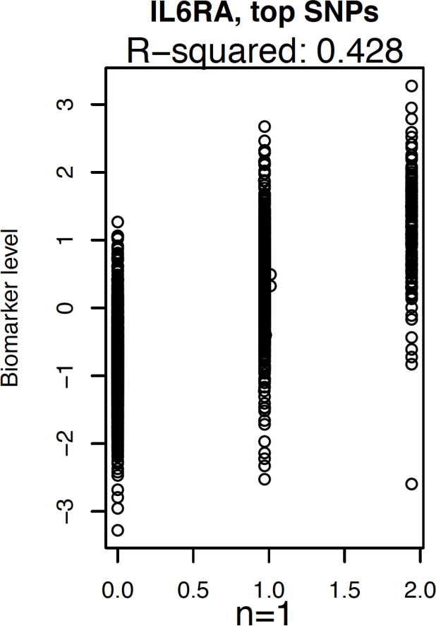

# chapter_paradata

> Talk is cheap. Show me the code.

[Linus Torvalds, 2000](https://lkml.org/lkml/2000/8/25/132)

> Picture of Karesuando's church,
> the village where the Northern Swedish Population
> Health Study started.
> From [`hopfner2005`]

> A cell has a nucleus that contains chromosomes. 
> Each of these chromosomes (46 in humans) consist out of DNA. 
> DNA itself conists out of 4 nucleotides, 
> as depicted by the horizontal sticks 
> with the colors red, yellow, green and blue.
> From [`sponk2012`]

> Parts of DNA (so-called 'genes') code for proteins. 
> The DNA, that always stays put in the cell's nucleus, 
> is transcripted to messenger RNA (mRNA).
> mRNA leaves the nucleus and its code gets translated to 
> a protein sequence.
> Near the start of a gene are regions that determine the amount
> of proteins produced (not shown in figure).
> Adapted from [`shafee2015`]

> An example result of a genetic epideological research.
> It shows that the SNP named rs12133641 (located at position 154,428,283
> of chromosome 1) is highly correlated (p value is 3.0 * 10e-73, 
> 961 individuals) to the concentration of the protein IL6RA, as measured
> in blood. The table is a simplified result from [`ahsan2017relative`].

> The relation between the genotype for SNP rs12133641 
> and the protein concentration of IL6RA is relatively strong.
> The X axis shows the the genotype of the individuals,
> where 0 denotes AA, 1.0 denotes AG and 2.0 denotes GG.
> The Y axis shows the concentration of the protein IL6RA 
> as found in the participants' blood. n = 1 denotes the number
> of SNPs that were determined to be involved.

> Levels of reproducibility, from [`peng2011reproducible`]

> Gene expression result due to an off-by-one error.
> The cells in the main table show how much mRNA is produced per cell 
> line (the columns) for different proteins (the rows).
> The colors above the cells, with the dendrogram, shows
> red for cells that do not respond (red) and do respond (blue) to an 
> antibiotic.
> The purple rectangles show samples that are duplicated.
> Note that, due to this, some
> samples that behave identically are both non-responders and responders.
> From [`baggerly2009deriving`]

> A typical GitHub repository [`bbbqarticleissue157`], 
> hosting the code for a
> computational experiment, 
> as published with [`bilderbeek2022transmembrane}.
> Note that this repository has 72 commits, where a commit is a change
> to the code.

> An overview of the commits that multiple contributors have
> made, in this case, to the code of DAISIE [`etienne2020daisie`]

> A build badge for the GitHub repository of this article.
> The description indicates which process it is that the badge
> signals success (as in this case) or failure of. 

> A build badge for the code coverage of an R 
> package (\url{https://github.com/ropensci/beautier}).
> The umbrella signals that the code coverage is hosted by
> CodeCov (\url{https://codecov.io/}). 
> The text indicates which process it is that the badge
> signals, which in this case, is that the code is fully covered
> by tests.

 
> An overview of the issues for the code for
> LDpred2 [`prive2020ldpred2`]. Of the 310 issues, 300 have been closed.
> The first four issues have been replied to, as indicated by the
> talk balloon. The fifth issues has a label with the text 'feature request'
> to signal the issue type.
